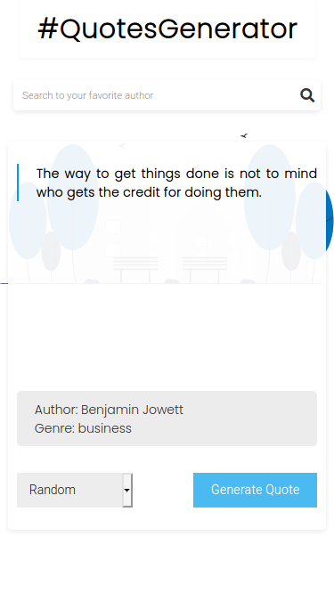
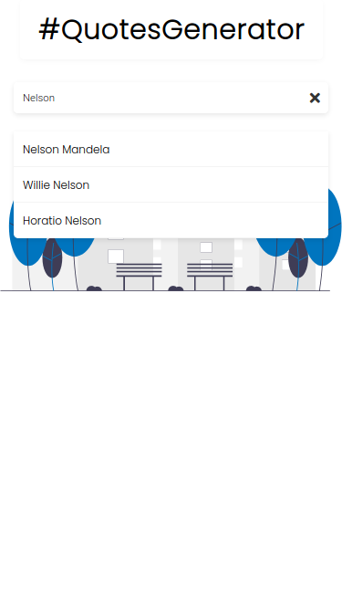

<!-- Please update value in the {}  -->

<h1 align="center"><a href="https://eufraniodiogo.github.io/AwesomeQuotes">Awesome Quotes</a></h1>

  <h3>
    <a href="https://eufraniodiogo.github.io/AwesomeQuotes">
      Demo
    </a>
     | 
    <a href="https://github.com/EufranioDiogo/AwesomeQuotes">
      Solution
    </a>
  </h3>

Do you like me? A guy or a girl that loves to read or listening inspaire quotes, that literaly can change my mind? If you said yes, this is the best website to get all the quotes that you need!

## Table of Contents

- [Table of Contents](#table-of-contents)
- [Overview](#overview)
  - [Built With](#built-with)
- [Contact](#contact)

## Overview

  

  

- Where can I see your demo? 
  [Here](https://eufraniodiogo.github.io/AwesomeQuotes)
- What was your experience? 
  First it was simple to build but while I was doing this, I said I want to use this app and I would like give a good experience to other bodies that will going to use, and I did my best.
- What have you learned/improved? 
  A lot of stuff that I didn't know but I really learned how to deal better with the API that I'm using <a href="https://github.com/pprathameshmore/QuoteGarden">QuoteGarden</a>, and I also applied my knowledges about Algorithms

### Built With

<!-- This section should list any major frameworks that you built your project using. Here are a few examples.-->

- JS
- Vue.js
- HTML
- CSS
- Algorithms

## Contact

- [Website](https://eufraniodiogo.github.io)
- [GitHub](https://github.com/EufranioDiogo)
- Email: eufraniodiogo5@gmail.com
